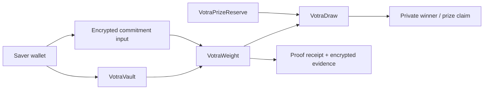

# Architecture

`VotraVault` owns principal accounting and advances weight before every balance mutation. `VotraCommitment` freezes one encrypted floor per round. `VotraWeight` stores the encrypted accumulator and compliance state. `VotraDraw` performs exact weighted selection after a measured randomness boundary. `VotraPrizeReserve` is funded separately so prizes cannot consume principal.

The first runnable build uses the reference model and a browser demonstrator; FHEVM adapters are intentionally isolated until current Zama APIs and HCU costs are verified.
