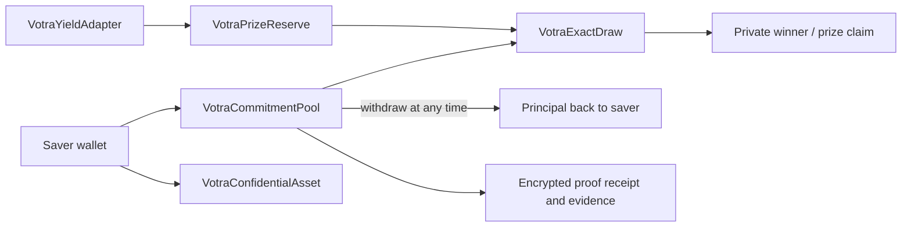

# Architecture

`VotraCommitmentPool` owns the encrypted balance, commitment floor, covenant state and CW accumulator. `VotraConfidentialAsset` is the ERC-7984 confidential balance and transfer layer. `VotraExactDraw` sums encrypted commitment weights and performs bounded exact rejection sampling over `[0, maxTotalWeight)`. `VotraYieldAdapter` keeps principal separate from realized yield and is the only path that funds the prize reserve. `VotraPrizeReserve` receives realized yield and settles the encrypted winner without touching participant principal.

The saver exits by withdrawing principal from the pool at any time, before or after
the draw; settlement never consumes saver principal. The explicit live withdrawal
receipt is recorded in `evidence/live/withdrawal-proof.json` on a fresh identical
disposable demo deployment so the frozen canonical round remains untouched.

The canonical stack deployed on Sepolia is Pool, ExactDraw, ConfidentialAsset, YieldAdapter, and PrizeReserve. The adapter is explicitly a **TESTNET YIELD ADAPTER / NOT LIVE MARKET YIELD**; no external market strategy is claimed.
