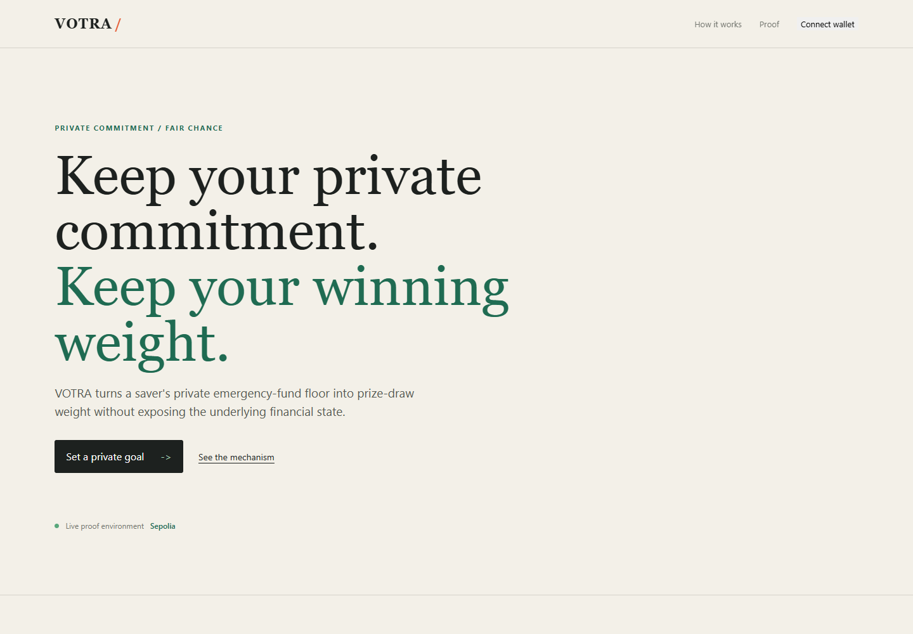
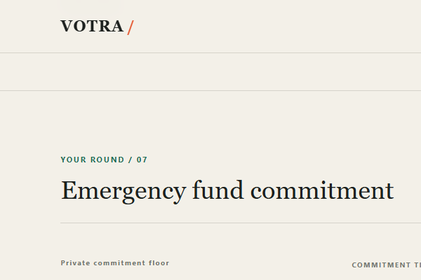
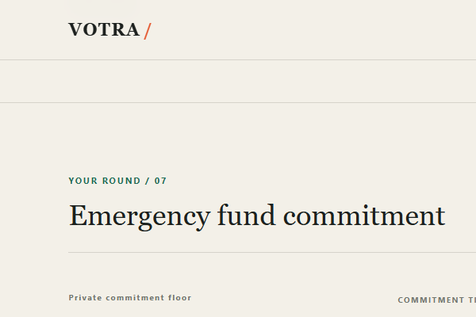
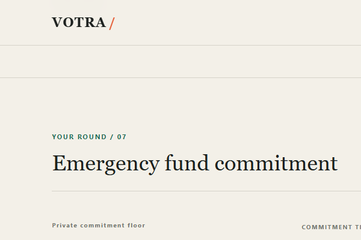
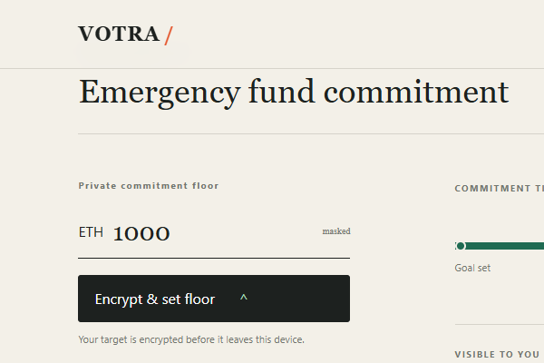
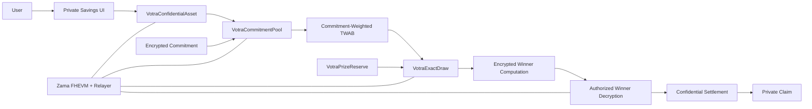
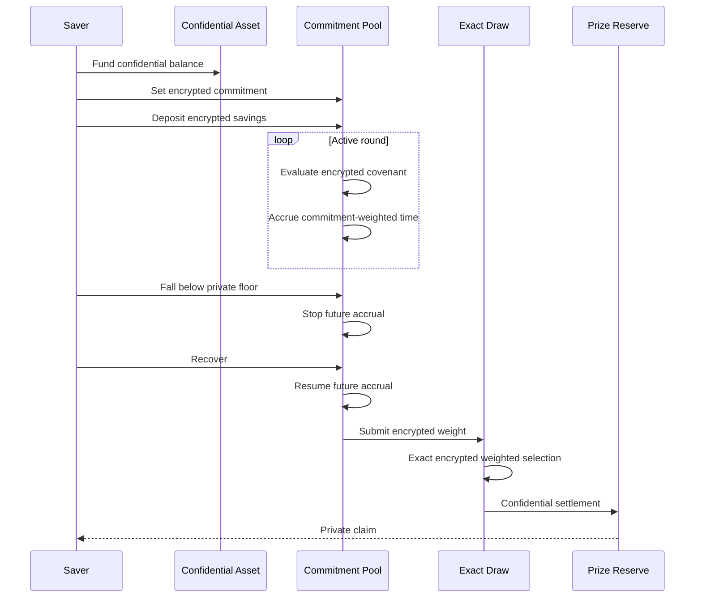

# VOTRA

**Private commitment. Fair chance.**

<p align="center">
  
  
  
  
  
</p>

<p align="center">
  
</p>

VOTRA is a confidential prize-savings protocol built around one idea: **private financial state can be hidden without making it economically irrelevant**.

A saver chooses a private financial commitment. VOTRA evaluates that commitment against an encrypted balance and turns only compliant balance-time into prize weight. The resulting history remains confidential while the protocol enforces its consequences onchain.

The result is a PoolTogether-style prize-savings experience with a deeper primitive underneath it:

> **Private financial state becomes a private rule that the public chain can still enforce.**

---

## Live Links

| Resource | Link |
|---|---|
| Live app | [votra-phi.vercel.app](https://votra-phi.vercel.app) |
| GitHub | [github.com/0xkinno/votra](https://github.com/0xkinno/votra) |
| Proof | [Live technical proof](https://votra-phi.vercel.app/proof/) |
| Pool | [`0xf6222981e6E727bb85e54B08E37B606598130165`](https://sepolia.etherscan.io/address/0xf6222981e6E727bb85e54B08E37B606598130165#code) |
| ExactDraw | [`0xBCED5BCF27Cb2a7a0DBb3291eCA8D06FeEd0a896`](https://sepolia.etherscan.io/address/0xBCED5BCF27Cb2a7a0DBb3291eCA8D06FeEd0a896#code) |
| Confidential Asset | [`0x8015B4a39cCbD4757A107A5F229ef14F24bB7b0B`](https://sepolia.etherscan.io/address/0x8015B4a39cCbD4757A107A5F229ef14F24bB7b0B#code) |
| Prize Reserve | [`0xa09C12Afd98F1284621299DaBFd6B1105dd7E3FD`](https://sepolia.etherscan.io/address/0xa09C12Afd98F1284621299DaBFd6B1105dd7E3FD#code) |
| Canonical campaign | [`evidence/live/canonical-campaign.json`](evidence/live/canonical-campaign.json) |

---

<table>
<tr>
<td align="center" width="50%">

<br />
<sub><b>Set a private floor</b><br />The commitment stays encrypted.</sub>
</td>
<td align="center" width="50%">

<br />
<sub><b>Build sealed weight</b><br />Compliant balance-time contributes to CW.</sub>
</td>
</tr>
<tr>
<td align="center" width="50%">

<br />
<sub><b>Break without erasing history</b><br />A breach stops future accrual. Recovery resumes it.</sub>
</td>
<td align="center" width="50%">

<br />
<sub><b>Draw and settle privately</b><br />Encrypted selection leads to confidential settlement.</sub>
</td>
</tr>
</table>

---

# Try It in 30 Seconds

1. Open the app.
2. Set a private savings floor.
3. Deposit confidential savings.
4. Stay compliant and watch prize weight accrue.
5. Trigger a breach. Future accrual stops, but earned history remains.
6. Recover. A new compliant segment begins immediately.
7. Run the encrypted draw.
8. Inspect the proof surface and canonical Sepolia campaign.

**The interface is the surface. The covenant is the protocol.**

---

# The Problem

A savings protocol can hide a balance without changing the economics underneath it.

If the final balance is the only meaningful input, a saver can end a round with the same balance as someone else while the protocol forgets everything that happened before that final state.

That loses an important piece of financial behavior:

**history.**

VOTRA asks a harder question:

> **Can a private financial commitment become an enforceable economic condition without revealing the financial state that proves whether it was satisfied?**

---

# The VOTRA Solution

VOTRA introduces a **Confidential Covenant**.

A saver chooses a private floor. The protocol evaluates the encrypted balance against that encrypted floor and allows only compliant balance-time to contribute to prize weight.

The core quantity is:

```text
CW_i = ∫ B_i(t) × C_i(t) dt
```

Where:

```text
B_i(t) = encrypted balance
C_i(t) = encrypted covenant state
CW_i   = commitment-weighted time balance
```

The draw therefore depends on a private economic history rather than a public final-state snapshot.

This creates a clean separation:

```text
PRIVATE INPUT
    ↓
PRIVATE POLICY
    ↓
ENCRYPTED EVALUATION
    ↓
COMMITMENT-WEIGHTED HISTORY
    ↓
EXACT ENCRYPTED SELECTION
    ↓
CONFIDENTIAL SETTLEMENT
```

---

# The Core Invariant

VOTRA is intentionally **forward-only**.

```text
COMPLIANT
    │
    │ balance-time earns weight
    ▼
BREACH
    │
    │ future accrual stops
    ▼
RECOVERY
    │
    │ new compliant time earns new weight
    ▼
COMPLIANT AGAIN
```

Three rules define the mechanism:

```text
1. Historical CW never decreases.

2. A breach can stop future accrual, but cannot erase
   previously earned compliant weight.

3. Recovery resumes future accrual, but never restores
   lost historical weight.
```

This prevents a final-state multiplier from rewriting the past.

---

# Why History Matters

Consider three savers:

```text
A
COMPLIANT → COMPLIANT → BREACH → RECOVERY

B
BREACH → RECOVERY → COMPLIANT → COMPLIANT

C
COMPLIANT → COMPLIANT → COMPLIANT → COMPLIANT
```

They can finish with the same balance.

Their commitment-qualified histories can still be different.

```text
same final balance
        ≠
same CW
```

That difference is what VOTRA carries into the prize draw.

The protocol does not ask only:

> "How much do you have now?"

It also asks:

> "How much of your private balance history actually satisfied your private commitment?"

---

# Architecture



## Contract Responsibilities

| Component | Responsibility |
|---|---|
| `VotraConfidentialAsset` | Confidential balances, transfers and funding |
| `VotraCommitmentPool` | Private commitment, covenant state and CW accrual |
| `VotraExactDraw` | Exact encrypted weighted winner selection |
| `VotraPrizeReserve` | Separate confidential prize funding and settlement |
| Reference model | Deterministic semantic oracle |
| Zama FHEVM | Encrypted computation and controlled decryption |

The prize reserve is deliberately separated from participant principal so prize settlement does not become an implicit path to savings withdrawal.

---

# Product Flow



---

# Exact Encrypted Selection

The first draw coordinator exposed a real economic weakness.

A fixed public slot space could contain a large unused region when encrypted participant weights were small. That allowed a valid zero-winner outcome even though eligible participants existed.

VOTRA did not solve this by shrinking slots in a way that could introduce overlap or bias.

The canonical coordinator instead uses bounded rejection sampling over an encrypted total-weight domain.

```text
Encrypted CW
      ↓
Encrypted total weight
      ↓
Bounded random sample
      ↓
Accept / reject
      ↓
Encrypted cumulative-weight predicates
      ↓
Winner
```

The randomness bound is chosen according to the FHEVM requirement for power-of-two bounds.

The reference implementation has passed:

```text
50,007 deterministic scenarios
0 mismatches
0 illegal winners
```

The full model and construction are documented in [`docs/DRAW_SELECTION.md`](docs/DRAW_SELECTION.md).

---

# Verification

VOTRA treats verification as part of the protocol, not as an appendix.

| Verification surface | Result |
|---|---|
| Reference model | Passing |
| Exact selection model | 50,007 scenarios, 0 mismatches |
| FHEVM tests | Passing |
| Multi-participant encrypted lifecycle | Live proven |
| Encrypted commitments | Live proven |
| Encrypted deposits | Live proven |
| Covenant breach | Live proven |
| Covenant recovery | Live proven |
| Encrypted draw | Live proven |
| Winner-bit decryption | Live proven |
| Confidential settlement | Live proven |
| Confidential claims | Live proven |
| Canonical Sepolia deployment | Live |
| Canonical source verification | Complete |
| Relayer smoke test | Passing |

---

# The Proof Strategy

VOTRA's development follows a deliberate loop:

```text
DISCOVER
   ↓
FRAME
   ↓
MODEL
   ↓
ATTACK
   ↓
BREAK
   ↓
FIX
   ↓
RETEST
   ↓
DEPLOY
   ↓
LIVE-PROVE
```

The protocol's most useful discovery came from exercising the original draw design rather than assuming it was correct.

The fixed-slot mechanism produced a zero-winner result.

That exposed the gap between a locally plausible coordinator and an economically exact one.

The result was not hidden.

It became a design input, the draw was replaced with an exact bounded-rejection coordinator, and the new selection semantics were tested against 50,007 deterministic scenarios before being deployed.

---

# Live Proof

The canonical Sepolia stack consists of four verified contracts:

| Contract | Sepolia address |
|---|---|
| `VotraCommitmentPool` | [`0xf6222981e6E727bb85e54B08E37B606598130165`](https://sepolia.etherscan.io/address/0xf6222981e6E727bb85e54B08E37B606598130165#code) |
| `VotraExactDraw` | [`0xBCED5BCF27Cb2a7a0DBb3291eCA8D06FeEd0a896`](https://sepolia.etherscan.io/address/0xBCED5BCF27Cb2a7a0DBb3291eCA8D06FeEd0a896#code) |
| `VotraConfidentialAsset` | [`0x8015B4a39cCbD4757A107A5F229ef14F24bB7b0B`](https://sepolia.etherscan.io/address/0x8015B4a39cCbD4757A107A5F229ef14F24bB7b0B#code) |
| `VotraPrizeReserve` | [`0xa09C12Afd98F1284621299DaBFd6B1105dd7E3FD`](https://sepolia.etherscan.io/address/0xa09C12Afd98F1284621299DaBFd6B1105dd7E3FD#code) |

The canonical encrypted campaign includes:

```text
3 funded participants
→ encrypted commitments
→ encrypted deposits
→ breach / recovery transitions
→ encrypted draw opening
→ encrypted winner computations
→ authorized winner decryption
→ confidential prize settlement
→ confidential claims
```

The complete generated record is [`evidence/live/canonical-campaign.json`](evidence/live/canonical-campaign.json).

The fresh history-specific campaign is recorded at
[`evidence/history-sensitivity/live-campaign.json`](evidence/history-sensitivity/live-campaign.json),
with its machine-readable model comparison at
[`evidence/live/model-chain-crosscheck.json`](evidence/live/model-chain-crosscheck.json).
All three participants finish with the same encrypted balance of `150`, while the
timestamp-derived reference weights are `136800`, `39600`, and `131400`. The
experiment isolates covenant history as the cause of the different draw weights.

---

# Security Model

The protocol is designed around explicit boundaries.

### Savings Principal

Participant principal remains separate from the prize reserve.

### Draw Authorization

Only the authorized draw path can invoke the relevant pool operations.

### Settlement

Prize settlement uses one-time protections to prevent duplicate claims or repeated settlement.

### Encrypted State

Balances, commitments, covenant state and weight remain encrypted through the FHE computation path.

### Forward-Only History

No recovery path can restore historical weight that was lost during a breach.

See [`SECURITY.md`](SECURITY.md).

---

# Privacy Model

VOTRA protects the state that determines financial eligibility and prize weight.

| State | Treatment |
|---|---|
| Balance | Encrypted |
| Commitment floor | Encrypted |
| Covenant state | Encrypted |
| Commitment-weighted history | Encrypted |
| Winner computation inputs | Encrypted |
| Wallet identity | Public blockchain metadata |
| Transaction timing | Public blockchain metadata |

The protocol does not claim to hide metadata that the underlying public blockchain inherently exposes.

See [`PRIVACY.md`](PRIVACY.md).

---

# Evidence

Every major claim should resolve to generated evidence.

The repository includes artifacts covering:

- canonical state transitions
- reference-model behavior
- forward-only invariants
- randomized fairness
- exact selection
- metamorphic testing
- adversarial analysis
- eight independent mined Sepolia guard reverts
- privacy analysis
- live deployment
- live receipts
- decryption
- benchmark measurements

Start with [`EVIDENCE.md`](EVIDENCE.md).

Canonical live campaign:

[`evidence/live/canonical-campaign.json`](evidence/live/canonical-campaign.json)

---

# Reproducibility

```bash
npm test
npm run test:fhe
npm run fairness:exact
npm run attack:receipts
npm run release:gate
npm run compile
npm run dev
```

The reference model is deterministic. Generated evidence records scenario counts, seeds and machine-produced results where applicable.

---

# Benchmarking

VOTRA distinguishes between local FHEVM measurement and live chain observation.

Mock HCU results are reported as mock measurements.

Live gas and transaction behavior are reported separately.

This distinction is intentional. It prevents development-environment measurements from being presented as production network economics.

See [`EVIDENCE.md`](EVIDENCE.md) for the generated benchmark artifacts.

---

## Documentation

| Document | Purpose |
|---|---|
| [`EVIDENCE.md`](EVIDENCE.md) | Generated evidence, live receipts, verification results and experiment artifacts |
| [`COMPLIANCE.md`](COMPLIANCE.md) | Season 4 challenge scope and compliance anchor |
| [`ARCHITECTURE.md`](ARCHITECTURE.md) | Contract boundaries and system design |
| [`SECURITY.md`](SECURITY.md) | Threat model, access control and security assumptions |
| [`PRIVACY.md`](PRIVACY.md) | Encrypted state and observable metadata |
| [`DECISIONS.md`](DECISIONS.md) | Key protocol and engineering decisions |
| [`docs/DRAW_SELECTION.md`](docs/DRAW_SELECTION.md) | Exact encrypted weighted-selection model |
| [`proof/`](proof/) | Judge-facing proof surface |
| [`evidence/live/`](evidence/live/) | Canonical live campaign evidence |
| [`packages/reference-model/`](packages/reference-model/) | Deterministic protocol reference model |
| [`contracts/`](contracts/) | Solidity contracts |

---

# Honest Limitations

The canonical exact encrypted lifecycle is live-proven on Sepolia.

The protocol proof is complete for the canonical encrypted lifecycle and the
equal-final-balance history counterexample. Eight deployed authorization and
state-machine attacks are independently mined as failed Sepolia transactions in
[`evidence/adversarial/executable-receipts.json`](evidence/adversarial/executable-receipts.json).

Public-chain metadata remains observable, and the exact draw's finite rejection
budget can theoretically exhaust without resolving a winner. These are explicit
properties of the privacy and liveness model, not unrecorded implementation gaps.
Real extension-wallet approval and rejection remain a user-controlled browser QA
step; the application uses one Reown AppKit connection and signing pipeline.

Mock HCU and live gas are separated in [`evidence/benchmarks/final-cost-summary.json`](evidence/benchmarks/final-cost-summary.json).

These boundaries are documented rather than hidden.

---

# Why VOTRA Exists

The core design can be reduced to one line:

```text
PRIVATE STATE
     ↓
PRIVATE POLICY
     ↓
ENCRYPTED ENFORCEMENT
     ↓
TEMPORAL ECONOMIC CONSEQUENCE
     ↓
EXACT ENCRYPTED SELECTION
```

The protocol does not treat confidentiality as a cosmetic layer around an ordinary savings application.

It uses encrypted financial state to make a financial rule enforceable.

**Keep the commitment private. Keep the history meaningful. Keep the chance fair.**

---

# License

MIT
