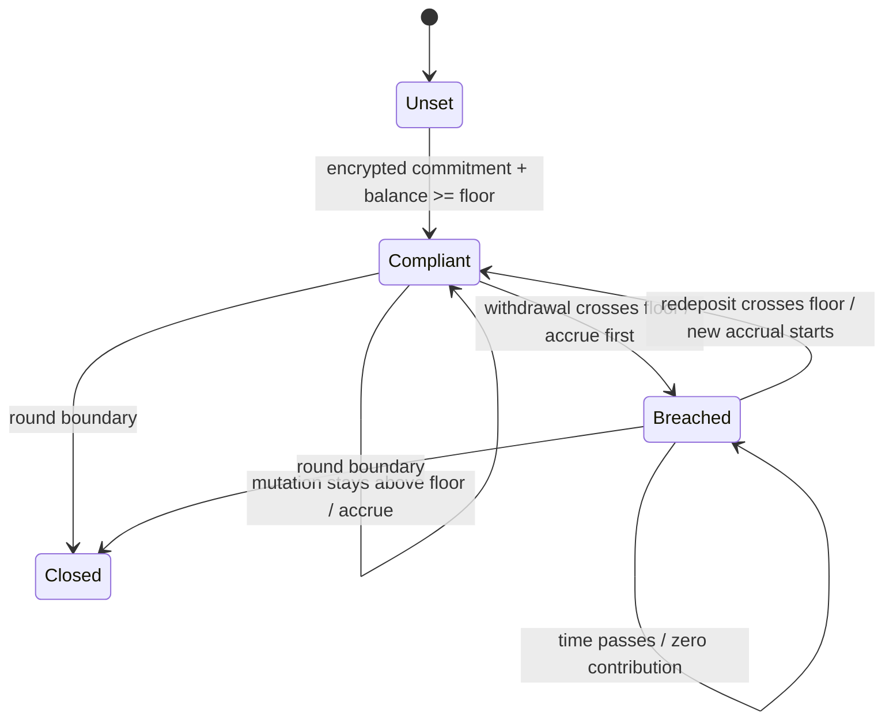

# Confidential Covenant Enforcement

VOTRA's covenant is a private rule: a saver chooses an encrypted floor and the protocol evaluates whether the encrypted balance satisfies it. The rule has an economic consequence without disclosing either operand.

## State Rules

- **Creation:** one encrypted floor is accepted per saver per round. A second commitment is rejected.
- **Balance:** deposits and withdrawals use encrypted inputs. The old balance is accrued before the new balance is stored.
- **Evaluation:** `covenant = (encryptedBalance >= encryptedFloor)` is an encrypted boolean.
- **Breach:** a crossing interval earns no future weight; prior compliant weight remains unchanged.
- **Recovery:** crossing back above the floor resumes accrual immediately, but never repairs the missed interval.
- **Rounds:** the floor is immutable for the round. A new round requires a new commitment.
- **Withdrawal:** requests are clamped with encrypted minimum semantics to avoid a public insufficient-balance oracle.
- **Redeployment:** repeated breach/recovery cycles are counted in encrypted state and cannot increase expected weight over uninterrupted compliance.

## Core Formula

`CW_i = integral(B_i(t) * C_i(t) dt)`, where `B` is the encrypted balance and `C` is the encrypted covenant bit. All implementation arithmetic is integer-based; elapsed time is seconds and weight is balance-seconds.

## Permissions And Leakage

The saver may decrypt their own floor, balance, covenant bit, weight, and cycle count when the relayer ACL grants it. The draw engine receives only the weight handle needed for selection. Operators do not receive standing access. Wallet identity, transaction timing, gas, and participation metadata remain public chain side channels; VOTRA is not an anonymity mixer.

## Economic Consequence

The commitment is not a display or a final multiplier. It changes the rate at which future balance-time becomes prize weight. A saver who breaches and recovers owns their principal and can earn again, but cannot rewrite history.
